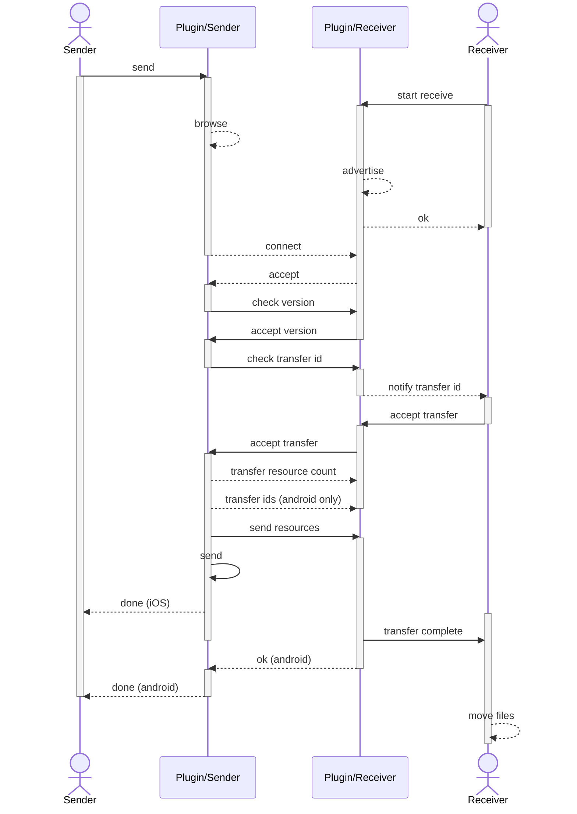

# @enertrag/p2pconnect

This Capacitor plugin enables file exchange between two devices. They do not need to be connected to the Internet and do not need to be on the same network.

The plugin uses peer-to-peer technologies of the respective platforms. Devices with iOS use MultipeerConnectivity, devices with Android use Google Nearby.

The plugin does not allow data exchange between devices of different systems (iOS vs. Android).

## Install

```bash
npm install @enertrag/p2pconnect
npx cap sync
```

## Examples

### Send

```typescript
// use Capacitor Filesystem plugin to get file uri
const fileUri = await Filesystem.getUri({
  directory: Directory.Data,
  path: 'foo/bar/example.json',
})

// define ids
const serviceId = 'p2p-test'
const transferId = 'share.json'

// creating resource descriptor
const resource: ResourceDescriptor = {
  id: 'example.json', // we use the filename here
  uri: fileUri,
}

// call plugin: method will return after the resource was
// sent to client or the user cancelled the process.
const result = await P2pConnect.send({
  serviceId,
  transferId,
  resources: [resource],
})
```

### Retrieve

```typescript
// on completion a callback will be called
P2pConnect.addListener('transferComplete', async (result) => {
  // We only handle a single file here.
  // It is also valid to send multiple files.
  // They always arrive in the same order in
  // which they were sent.
  const resource = result.resources[0]

  // The resource uri is a random temp file.
  // Especially the file name differs from the sender!

  // We use the resource id as the filename
  const fileTargetPath = '/target/foobar/' + resource.id

  // We move(!) the file to the final target,
  // for we are responsible for cleaning up the temp file.
  await Filesystem.rename({
    from: resource.uri,
    toDirectory: Directory.Data,
    to: fileTargetPath,
  })
})

// must be equal for sender and receiver,
// otherwise the devices can't see each other
const serviceId = 'p2p-test'

// the method returns immediatly,
// we must call stopReceive() to stop accepting connections.
const result = await P2pConnect.startReceive({
  serviceId,
})
```

### Accepting transfer (receiver)

```typescript
// register callback
P2pConnect.addListener('acceptTransfer', (request) => {
  const transferId: string = request.transferId
  let result = false

  if (transferId.startsWith('share.')) {
    // decide on the basis of the data provided
    // result = customCheck();

    result = true
  }

  // The method must be executed within 30 seconds,
  // otherwise the process terminates.
  // The sender is blocked during this time.
  P2pConnect.acceptTransfer({
    transferId,
    accept: result,
  })
})
```

## Sequence

The following flowchart describes the communication between sender and receiver.



## API

<docgen-index>

- [`isAvailable()`](#isavailable)
- [`removeAllListeners()`](#removealllisteners)
- [`addListener(...)`](#addlistener)
- [`addListener(...)`](#addlistener)
- [`send(...)`](#send)
- [`startReceive(...)`](#startreceive)
- [`stopReceive()`](#stopreceive)
- [`acceptTransfer(...)`](#accepttransfer)
- [Interfaces](#interfaces)
- [Enums](#enums)

</docgen-index>

<docgen-api>
<!--Update the source file JSDoc comments and rerun docgen to update the docs below-->

The methods of the peer-to-peer interface are described below.

### isAvailable()

```typescript
isAvailable() => any
```

Indicates whether the Peer to Peer function is available on the device.

**Returns:** <code>any</code>

**Since:** 1.0.0

---

### removeAllListeners()

```typescript
removeAllListeners() => any
```

Remove all native listeners for this plugin.

**Returns:** <code>any</code>

**Since:** 1.0.0

---

### addListener(...)

```typescript
addListener(eventName: 'acceptTransfer', listenerFunc: (request: AcceptTransferRequest) => void) => Promise<PluginListenerHandle> & PluginListenerHandle
```

The notification is triggered on the recipient's side when a new transfer
is received that needs to be confirmed.

| Param              | Type                                                                                          |
| ------------------ | --------------------------------------------------------------------------------------------- |
| **`eventName`**    | <code>"acceptTransfer"</code>                                                                 |
| **`listenerFunc`** | <code>(request: <a href="#accepttransferrequest">AcceptTransferRequest</a>) =&gt; void</code> |

**Returns:** <code>any</code>

---

### addListener(...)

```typescript
addListener(eventName: 'transferComplete', listenerFunc: (result: TransferResult) => void) => Promise<PluginListenerHandle> & PluginListenerHandle
```

Notification is triggered on the recipient's side
when a transfer is complete.

| Param              | Type                                                                           |
| ------------------ | ------------------------------------------------------------------------------ |
| **`eventName`**    | <code>"transferComplete"</code>                                                |
| **`listenerFunc`** | <code>(result: <a href="#transferresult">TransferResult</a>) =&gt; void</code> |

**Returns:** <code>any</code>

---

### send(...)

```typescript
send(options: SendOptions) => any
```

Starts a transfer on the sender's side.

| Param         | Type                                                |
| ------------- | --------------------------------------------------- |
| **`options`** | <code><a href="#sendoptions">SendOptions</a></code> |

**Returns:** <code>any</code>

---

### startReceive(...)

```typescript
startReceive(options: ReceiveOptions) => any
```

Activates the reception of a transfer on the recipient's side.

| Param         | Type                                                      |
| ------------- | --------------------------------------------------------- |
| **`options`** | <code><a href="#receiveoptions">ReceiveOptions</a></code> |

**Returns:** <code>any</code>

---

### stopReceive()

```typescript
stopReceive() => any
```

Cancels the reception on the receiver's side.

**Returns:** <code>any</code>

---

### acceptTransfer(...)

```typescript
acceptTransfer(options: AcceptTransferOptions) => any
```

Must be called in response to the 'acceptTransfer'
notification and determines on the recipient's side whether the
transfer should be accepted or rejected.

| Param         | Type                                                                    |
| ------------- | ----------------------------------------------------------------------- |
| **`options`** | <code><a href="#accepttransferoptions">AcceptTransferOptions</a></code> |

**Returns:** <code>any</code>

---

### Interfaces

#### AcceptTransferRequest

Describes a request to the recipient to confirm
or decline acceptance of the transfer.

| Prop             | Type                | Description                                             |
| ---------------- | ------------------- | ------------------------------------------------------- |
| **`transferId`** | <code>string</code> | The ID of the transfer whose status is to be confirmed. |

#### PluginListenerHandle

| Prop         | Type                      |
| ------------ | ------------------------- |
| **`remove`** | <code>() =&gt; any</code> |

#### TransferResult

The result of a transmission process for the receiver.

| Prop             | Type                | Description                            |
| ---------------- | ------------------- | -------------------------------------- |
| **`transferId`** | <code>string</code> | The ID for the transfer process.       |
| **`resources`**  | <code>{}</code>     | The list of the transferred resources. |

#### ResourceDescriptor

Describes a resource to be transferred.

| Prop      | Type                | Description                                                                                                                                                                          |
| --------- | ------------------- | ------------------------------------------------------------------------------------------------------------------------------------------------------------------------------------ |
| **`id`**  | <code>string</code> | An identifier for the resource. This will be the same for sender and receiver.                                                                                                       |
| **`uri`** | <code>string</code> | The resource URI. This must be an absolute URI. It will include a schema, depending of the target system. The path (especially the last part) will vary between sender and receiver. |

#### SendOptions

Defines the parameters of the sender to transfer files.

| Prop             | Type                | Description                                                                                                                                                                                                                                                                                                                                                                                                                                                                                                                                    |
| ---------------- | ------------------- | ---------------------------------------------------------------------------------------------------------------------------------------------------------------------------------------------------------------------------------------------------------------------------------------------------------------------------------------------------------------------------------------------------------------------------------------------------------------------------------------------------------------------------------------------- |
| **`serviceId`**  | <code>string</code> | The identifier for the P2P process. Only devices that use the same identifier can be found. To remain compatible with iOS devices, the identifier must meet the following criteria: &lt;ul&gt; &lt;li&gt;Must be 1–15 characters long&lt;/li&gt; &lt;li&gt;Can contain only ASCII lowercase letters, numbers, and hyphens&lt;/li&gt; &lt;li&gt;Must contain at least one ASCII letter&lt;/li&gt; &lt;li&gt;Must not begin or end with a hyphen&lt;/li&gt; &lt;li&gt;Must not contain hyphens adjacent to other hyphens.&lt;/li&gt; &lt;/ul&gt; |
| **`transferId`** | <code>string</code> | The ID for the transfer process.                                                                                                                                                                                                                                                                                                                                                                                                                                                                                                               |
| **`resources`**  | <code>{}</code>     | The list of the resources to be transferred.                                                                                                                                                                                                                                                                                                                                                                                                                                                                                                   |

#### ReceiveOptions

Defines the parameters for receiving a transfer.

| Prop            | Type                | Description                                                                                                                                                                                                                                                                                                                                                                                                                                                                                                                                    |
| --------------- | ------------------- | ---------------------------------------------------------------------------------------------------------------------------------------------------------------------------------------------------------------------------------------------------------------------------------------------------------------------------------------------------------------------------------------------------------------------------------------------------------------------------------------------------------------------------------------------- |
| **`serviceId`** | <code>string</code> | The identifier for the P2P process. Only devices that use the same identifier can be found. To remain compatible with iOS devices, the identifier must meet the following criteria: &lt;ul&gt; &lt;li&gt;Must be 1–15 characters long&lt;/li&gt; &lt;li&gt;Can contain only ASCII lowercase letters, numbers, and hyphens&lt;/li&gt; &lt;li&gt;Must contain at least one ASCII letter&lt;/li&gt; &lt;li&gt;Must not begin or end with a hyphen&lt;/li&gt; &lt;li&gt;Must not contain hyphens adjacent to other hyphens.&lt;/li&gt; &lt;/ul&gt; |

#### AcceptTransferOptions

Accepts or rejects a transfer.

| Prop             | Type                 | Description                                                                                   |
| ---------------- | -------------------- | --------------------------------------------------------------------------------------------- |
| **`transferId`** | <code>string</code>  | The ID for the transfer process.                                                              |
| **`accept`**     | <code>boolean</code> | &lt;code&gt;true&lt;code&gt; to accept the transfer, &lt;code&gt;fale&lt;/code&gt; otherwise. |

### Enums

#### SendError

| Members                   | Value                              | Description                                                |
| ------------------------- | ---------------------------------- | ---------------------------------------------------------- |
| **`transferInterrupted`** | <code>'transferInterrupted'</code> | The transfer was interrupted by either sender or receiver. |
| **`versionMismatch`**     | <code>'versionMismatch'</code>     | The plugin version differs between sender and receiver.    |
| **`transferDenied`**      | <code>'transferDenied'</code>      | The recipient has refused to receive the transfer.         |
| **`cancelled`**           | <code>'cancelled'</code>           | The sending process was cancelled.                         |
| **`permissionDenied`**    | <code>'permissionDenied'</code>    | The user has not granted the requested permissions.        |
| **`internalError`**       | <code>'internalError'</code>       | An internal error occured. Something went terribly wrong.  |
| **`connectionFailed`**    | <code>'connectionFailed'</code>    | The connection between the peers could not be established. |

</docgen-api>
